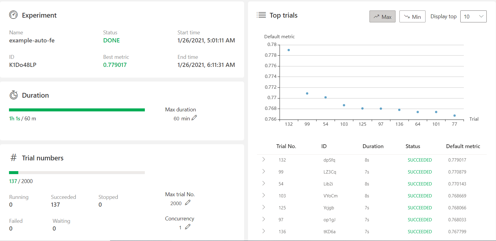
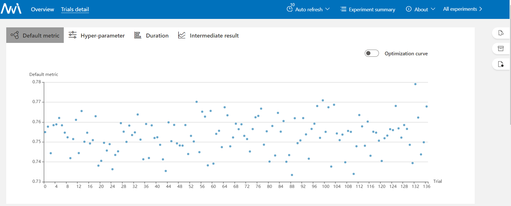

# Task3.1实验报告

## 关于特征工程：

> 特征工程是使用领域知识通过数据挖掘技术从原始数据中提取特征的过程。这些功能可用于提高机器学习算法的性能。可以将特征工程视为应用机器学习本身
> 目的是最大限度地从原始数据中提取特征以供算法和模型使用

## 本机运行实验配置

> 实验环境: 
> - System: windows10
> - NNI version: 2.0
> - Python version: 3.8.3
> - Pytorch version: 1.6.0
> - Tensorflow version: 2.3.0
> - Numpy version: 1.18.5
> - Matplotlib version: 3.2.2 
> - Torchvision version: 0.7.0
> - Pandas version 1.0.5

> 值得注意的是：原示例程序使用了旧版本pandas的api，若使用**0.25**版本的pandas就直接可以，当然也可以对`fe_util.py`进行少许改动即刻成功运行（这里笔者采用了后者）

`config.yml`:

```yml
authorName: default
experimentName: example-auto-fe
trialConcurrency: 1
maxExecDuration: 1h
maxTrialNum: 2000
#choice: local, remote
trainingServicePlatform: local
searchSpacePath: search_space.json
#choice: true, false
useAnnotation: false
tuner:
  codeDir: .
  classFileName: autofe_tuner.py
  className: AutoFETuner
  classArgs:
    optimize_mode: maximize
trial:
  command: python main.py
  codeDir: .
  gpuNum: 0

```

`search_space.json`

```json
{
    "count":[
        "C1","C2","C3","C4","C5","C6","C7","C8","C9","C10",
        "C11","C12","C13","C14","C15","C16","C17","C18","C19",
        "C20","C21","C22","C23","C24","C25","C26"
    ],
    "aggregate":[
        ["I9","I10","I11","I12"],
        [
            "C1","C2","C3","C4","C5","C6","C7","C8","C9","C10",
            "C11","C12","C13","C14","C15","C16","C17","C18","C19",
            "C20","C21","C22","C23","C24","C25","C26"
        ]
    ],
    "crosscount":[
        [
            "C1","C2","C3","C4","C5","C6","C7","C8","C9","C10",
            "C11","C12","C13","C14","C15","C16","C17","C18","C19",
            "C20","C21","C22","C23","C24","C25","C26"
        ],
        [
            "C1","C2","C3","C4","C5","C6","C7","C8","C9","C10",
            "C11","C12","C13","C14","C15","C16","C17","C18","C19",
            "C20","C21","C22","C23","C24","C25","C26"
        ]
    ]
}
```

## 实验代码

`main.py`:

```python
import nni

if __name__ == '__main__':
    file_name = "train.tiny.csv"
    target_name = "Label"
    id_index = "Id"
	RECEIVED_PARAMS = nni.get_next_parameter()
	logger.info("Received params:\n", RECEIVED_PARAMS)

	df = pd.read_csv(file_name)
	if 'sample_feature' in RECEIVED_PARAMS.keys():
    	sample_col = RECEIVED_PARAMS['sample_feature']
	else:
    	sample_col = []

    df = name2feature(df, sample_col, target_name)
    feature_imp, val_score = lgb_model_train(df,  _epoch = 1000, target_name = target_name, id_index = id_index)
    
    nni.report_final_result({
        "default":val_score, 
        "feature_importance":feature_imp
    })
```


## 实验效果

> 如图






